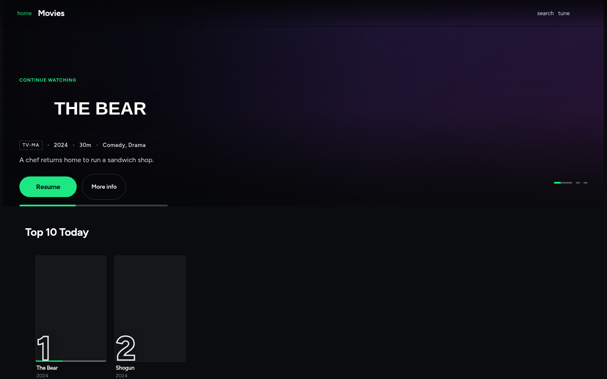

# JellyHulu

A Hulu-inspired theme for [Jellyfin](https://jellyfin.org). Near-black ground,
Hulu green, a full-bleed hero carousel, rails of cards that expand and preview
on hover — and, unlike most streaming skins, complete coverage of the parts
that make Jellyfin *Jellyfin*: Live TV and the DVR, SyncPlay, collections and
playlists, music and lyrics, books and photos, the metadata and subtitle
editors, the admin dashboard, and third-party plugin pages.

It ships as three pieces, and you need at most two of them:

| Piece | What it is | Required? |
| --- | --- | --- |
| `dist/jellyhulu.min.css` | The theme. One stylesheet, no dependencies, no external requests. | Yes |
| `dist/jellyhulu.min.js` | The companion. Adds the hero carousel, hover previews, rank badges, a per-user settings panel, and TV navigation. | No — the CSS is a complete theme on its own |
| **The Jellyfin plugin** | Serves both from your server and keeps the web client pointing at them across upgrades. Adds a configuration page. | No — but it's the easiest way to get the other two |

---

## Quick start

### With the plugin (recommended)

No shell access, no files to copy, and it survives Jellyfin upgrades.

1. **Dashboard → Plugins → Repositories → +**, and add:

   ```
   https://github.com/jmaudlin/JellyHulu/releases/latest/download/manifest.json
   ```

2. **Dashboard → Plugins → Catalogue → JellyHulu → Install**, then restart Jellyfin.
3. Hard-reload your browser (<kbd>Ctrl</kbd>/<kbd>Cmd</kbd> + <kbd>Shift</kbd> + <kbd>R</kbd>).

One caveat worth knowing up front: the plugin has to write to Jellyfin's own
web client directory, which is **not** writable on a Debian/Ubuntu package
install until you `chown` it. It reports the problem clearly instead of
failing silently, and **[docs/PLUGIN.md](docs/PLUGIN.md)** covers the fix and
the alternatives.

### By hand

```bash
git clone https://github.com/jmaudlin/JellyHulu.git
cd JellyHulu
sudo ./scripts/install-jellyhulu.sh
```

Then in Jellyfin: **Dashboard → General → Custom CSS**, add

```css
@import url('/web/jellyhulu/jellyhulu.min.css');
```

and hard-reload.

Only want the CSS? Skip both — paste the contents of
`dist/jellyhulu.min.css` straight into the Custom CSS box. Full options,
including reverse-proxy and Docker setups that survive server upgrades, are in
**[docs/INSTALL.md](docs/INSTALL.md)**.

---

## What you get

**The look.** Hulu's near-black `#0B0C0F` ground and `#1CE783` green, set in
Figtree — an open geometric grotesque chosen to sit where Hulu's proprietary
Graphik does. Square-ish tiles with hairline borders, dense rails that bleed
off the right edge, tight headline tracking, and a translucent header that
turns to glass the moment you scroll.

**A hero carousel** built from Continue Watching, then Next Up, then Recently
Added — so the first thing on screen is the thing you actually came back for,
with a Resume button and a progress bar. It pauses when you hover it, when you
focus inside it, and when the tab is hidden.

**Cards that behave like Hulu's.** They scale in place on hover with an action
overlay and a metadata block. Nothing below them moves — the expanded panel
that pushes its siblings around is the single biggest source of jank in
Netflix-style themes, and it is deliberately not what this does.

**Hover previews, with a fallback ladder.** A local trailer if the library has
one; otherwise Jellyfin's own trickplay tiles animated as a flipbook — one
already-generated JPEG, no transcode, no per-second bandwidth; otherwise
nothing, and the card keeps its still.

**Every surface, themed.** Not just the home page:

<details>
<summary>The full list</summary>

- Home, libraries, grids, detail pages, person and genre pages, search
- Login, user select, server select, Quick Connect, the setup wizard
- The video OSD: scrub bar, trickplay bubble, chapter markers, Skip Intro, up-next
- Live TV: the EPG grid with a sticky timeline, genre accents, a live playhead, DVR and timers
- Music: the now-playing bar, the full-screen player, albums, queues, and time-synced lyrics
- SyncPlay, collections (rendered as card stacks), playlists
- Books, photos and the slideshow
- Metadata editor, image editor, identify, subtitle search
- The admin dashboard — both the legacy `.emby-*` pages and the React/MUI ones in 10.10+
- Third-party plugin configuration pages
- 10-foot TV mode, phones, tablets, ultrawides, and print

</details>

**A settings panel, per user.** A `tune` button appears in the header. Accent
colour, card density, motion level, hover previews, hero on/off, badges,
TV mode, effects, contrast. Everything saves per Jellyfin user, so each person
in the house gets their own feel from one server-wide stylesheet.

**Accessible by default.** `prefers-reduced-motion`, `prefers-contrast`,
`prefers-reduced-data` and `forced-colors` are all honoured. There's a skip
link, a live region that announces route changes, keyboard-visible focus rings
throughout, and rank badges that reach screen readers as text.

---

## Screens



*Rendered by the test fixture in `test/` — placeholder artwork, real theme.*

---

## Configuration

Every visual decision is a CSS custom property in one block at the top of the
stylesheet. To change something server-wide, redeclare it **after** the
`@import`:

```css
@import url('/web/jellyhulu/jellyhulu.min.css');

:root {
  --jh-accent: #FF4D8D;        /* recolours the entire UI */
  --jh-radius-card: 10px;      /* rounder tiles */
  --jh-card-w-portrait: 190px; /* bigger posters */
  --jh-gutter: 2rem;           /* tighter page margins */
}
```

With the plugin installed there's a configuration page for the same thing —
accent, density, motion, previews, badges and a Custom CSS box — plus
server-wide defaults that each user can still override for themselves.

The full token reference, the density and motion presets, and the settings
the companion script writes are in
**[docs/CONFIGURATION.md](docs/CONFIGURATION.md)**.

---

## Large libraries

Tested against grids in the thousands. The techniques that matter:

- **`content-visibility: auto`** on grid cards and off-screen rails, with
  `contain-intrinsic-size` placeholders so the scrollbar doesn't jump.
- **`contain`** on cards, rails and the hero, so one card animating doesn't
  re-layout its neighbours.
- **No layout-affecting hover.** Hover is `transform` and `opacity` only —
  both composited, neither triggering layout.
- **`will-change` only while hovered**, never left on. A permanently promoted
  layer per card is slower than no promotion at all.
- **Hover transitions suspended during scroll**, so flicking through a long
  grid doesn't start an animation on every card the pointer sweeps past.
- **Lazy enhancement.** The companion enhances cards through an
  `IntersectionObserver` as they approach the viewport, not all at once.
- **Low-power mode**, engaged automatically on 2-core / 2 GB / save-data /
  TV clients, which drops blur, heavy shadows and previews.

---

## Requirements

- Jellyfin **10.10.x** or **10.11.x** — selectors cover both, defensively.
- A browser-based client: any modern browser, Jellyfin Media Player, or the
  web UI on a TV. Native Android/iOS/Roku apps don't read server CSS and are
  unaffected.
- The companion script needs nothing installed; the build needs Node 18+.

See **[docs/COMPATIBILITY.md](docs/COMPATIBILITY.md)** for what's covered on
each version and which clients apply the theme.

---

## Building from source

```bash
npm install       # optional — only for minification
npm run build     # writes dist/
npm run check     # build, then fail on any sanity problem
node test/smoke.mjs   # drive a mock Jellyfin DOM in a real browser
```

The build concatenates `src/css/*.css` in order, generates the `@font-face`
layer in two flavours (fonts embedded as data URIs, or linked from a path),
wraps `src/js/*.js` in a single IIFE, and verifies the result: braces balance,
every `var(--jh-*)` resolves to a real declaration, the version placeholder is
substituted, and the JS parses.

The plugin needs the .NET 8 SDK on top of that:

```bash
dotnet test plugin/Jellyfin.Plugin.JellyHulu.Tests -c Release
plugin/package.sh --version 1.0.0.0    # → plugin/artifacts/
```

Layout and architecture are described in
**[docs/ARCHITECTURE.md](docs/ARCHITECTURE.md)**, and the plugin specifically
in **[docs/PLUGIN.md](docs/PLUGIN.md)**.

---

## Troubleshooting

Theme not applying, script not loading, previews not playing, a plugin page
looking wrong after an upgrade — **[docs/TROUBLESHOOTING.md](docs/TROUBLESHOOTING.md)**.

To remove everything: uninstall the plugin (it cleans up after itself on
shutdown), or, for a manual install:

```bash
sudo ./scripts/install-jellyhulu.sh --uninstall
```

then delete the `@import` line from Custom CSS.

---

## Licence and attribution

MIT — see [LICENSE](LICENSE).

Bundled typeface: **Figtree** by Erik D. Kennedy, SIL Open Font License 1.1
([fonts/Figtree-OFL.txt](fonts/Figtree-OFL.txt)).

JellyHulu is an independent, unofficial theme. It is **not affiliated with,
endorsed by, or connected to** Hulu, LLC, The Walt Disney Company, or the
Jellyfin project. It ships no Hulu artwork, logos, fonts or code — it is an
original stylesheet that takes visual inspiration from Hulu's interface.
"Hulu" is a trademark of its owner.
